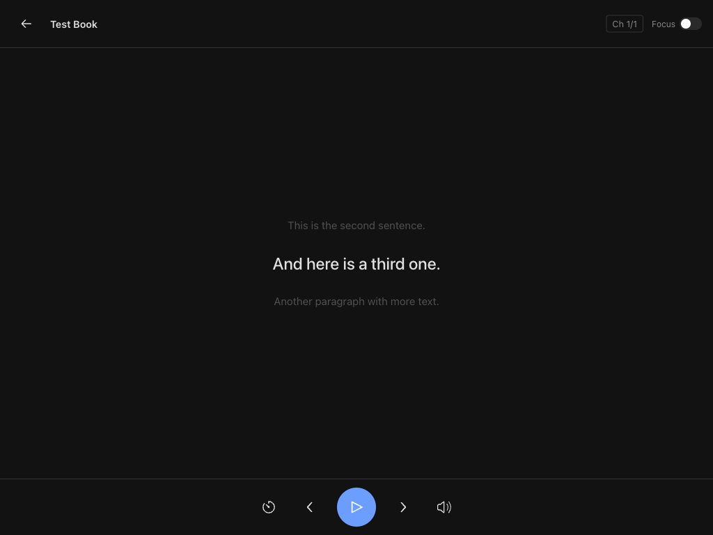
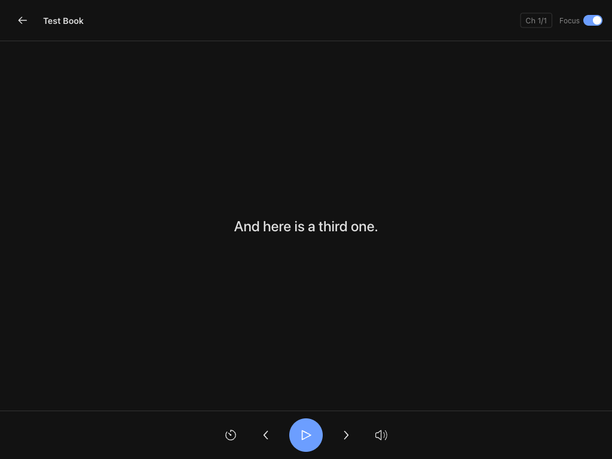

# Lector

A minimalist epub reader that reads to you. One sentence at a time.

> Built almost entirely through AI vibe coding to test the capabilities of Ralph Wiggum loop and the new Opus 4.6 model.

---

## What it does

Upload an epub, open it, hit play. Lector reads aloud sentence by sentence using your browser's native text-to-speech engine. It remembers where you left off.

- **Sentence-level focus** — one sentence highlighted at a time, context sentences faded around it
- **Focus mode** — strip everything away, just the current sentence
- **TTS controls** — play/pause, previous/next sentence, playback speed, voice selection
- **Progress tracking** — resumes from where you stopped
- **Chapter navigation** — jump between chapters
- **Keyboard shortcuts** — space to play/pause, arrow keys to navigate

## Screenshots

**Library**


**Reader**



**Focus mode**



---

## Stack

- **Frontend:** React 19 + Vite + TypeScript + Radix UI + SCSS
- **Backend:** Fastify + TypeScript
- **Database:** SQLite (better-sqlite3)
- **TTS:** Web Speech API (browser-native, no API keys)
- **Monorepo:** pnpm workspaces
- **Deployment:** Docker + docker-compose

## Running locally

**Prerequisites:** Node.js 20+, pnpm

```bash
pnpm install
pnpm --filter server dev   # starts API on :3000
pnpm --filter client dev   # starts UI on :5173
```

## Running with Docker

```bash
docker-compose up
```

App available at `http://localhost:3000`.

## Usage

1. Click **Add** to upload an epub file
2. Click a book to open it
3. Hit **Play** (or press `Space`) to start listening
4. Use `←` / `→` to move between sentences
5. Toggle **Focus** to hide surrounding context
6. Progress is saved automatically

---

## License

MIT
