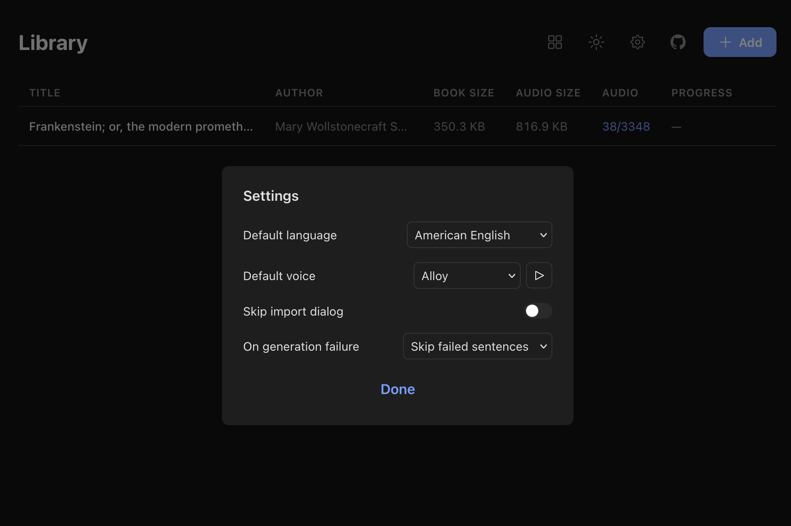

# Lector

A minimalist epub reader that reads to you. One sentence at a time.

> Built almost entirely through AI vibe coding to test the capabilities of Ralph Wiggum loop and the new Opus 4.6 model.

---

## What it does

Upload an epub, pick a voice, hit play. Lector reads aloud sentence by sentence using [Kokoro-82M](https://github.com/hexgrad/kokoro), a high-quality local TTS model. It remembers where you left off.

- **Server-side TTS** — Kokoro-82M generates natural-sounding audio for every sentence, cached on disk
- **Multi-language** — American/British English, Spanish, French, Hindi, Italian, Brazilian Portuguese (Japanese and Mandarin available with extra deps)
- **Voice selection** — 50+ voices across languages, with preview/demo playback
- **Sentence-level focus** — one sentence highlighted at a time, context sentences faded around it
- **Focus mode** — strip everything away, just the current sentence
- **TTS controls** — play/pause, previous/next sentence, adjustable playback speed (0.5x–3.0x)
- **Progress tracking** — resumes from where you stopped, both reading position and audio generation
- **Chapter navigation** — jump between chapters
- **Library views** — grid (cover art) or table (title, author, file size, audio status, progress)
- **Settings** — default voice/language, skip import dialog, error behavior on generation failure
- **Keyboard shortcuts** — space to play/pause, arrow keys to navigate, `[`/`]` for speed

## Screenshots

**Library**


**Table view**


**Reader**


**Settings**




---

## Architecture

```
┌─────────┐     HTTP      ┌──────────┐    HTTP     ┌─────────────┐
│  Client  │ ◄──────────► │  Fastify  │ ──────────► │  Python TTS  │
│  (React) │              │  Server   │             │  (FastAPI)   │
└─────────┘               └────┬──────┘             └──────┬──────┘
                               │                           │
                          ┌────▼──────┐              ┌─────▼─────┐
                          │  SQLite   │              │ Kokoro-82M │
                          │  + disk   │              │  (PyTorch) │
                          └───────────┘              └───────────┘
```

## Stack

- **Frontend:** React 19 + Vite + TypeScript + Radix UI + SCSS
- **Backend:** Fastify + TypeScript
- **TTS:** Kokoro-82M via FastAPI sidecar (PyTorch, CPU)
- **Database:** SQLite (better-sqlite3)
- **Audio format:** OGG/Vorbis, cached on disk, content-addressed by hash
- **Monorepo:** pnpm workspaces
- **Deployment:** Docker Compose (two services: app + TTS)

## Running with Docker Compose

```bash
docker compose up
```

This starts two services:
- **lector** — the main app on `http://localhost:3000`
- **tts** — the Kokoro TTS service (internal, port 5000)

The TTS model (~330MB) downloads on first startup. Model loading takes ~30s on CPU.

Data persists in `./data/` (SQLite DB, epub files, covers, cached audio).

## Running locally (development)

**Prerequisites:** Node.js 22+, pnpm, Python 3.11+

```bash
# Start TTS service
cd tts && pip install -r requirements.txt && uvicorn main:app --port 5000

# In another terminal — start the app
pnpm install
pnpm dev:server   # API on :3000
pnpm dev:client   # UI on :5173
```

## Usage

1. Click **Add** to upload an epub file
2. Pick a language and voice (or configure defaults in **Settings**)
3. Audio generation starts automatically in the background
4. Click a book to open it
5. Hit **Play** (or press `Space`) to start listening
6. Use `←` / `→` to move between sentences, `[` / `]` for speed
7. Toggle **Focus** to hide surrounding context
8. Switch between grid and table view in the library header

### How audio generation works

On import, the server sends each sentence to the Kokoro TTS service and caches the resulting audio file. Sentences are hashed by content + voice + language, so duplicate sentences across books share a single audio file.

If the server restarts mid-generation, it picks up where it left off — already-generated sentences are skipped.

You can start reading as soon as the first sentences are ready; the client prefetches upcoming audio in the background.

---

## License

MIT
